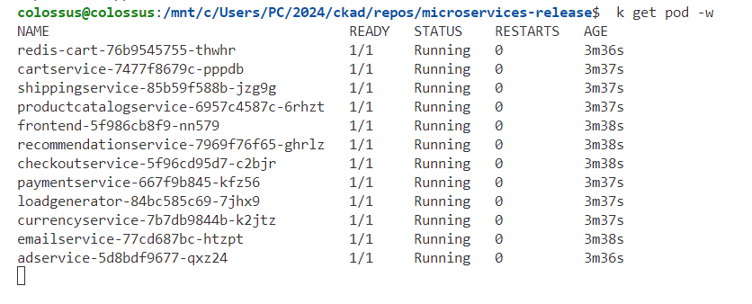
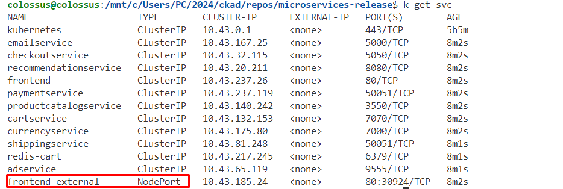
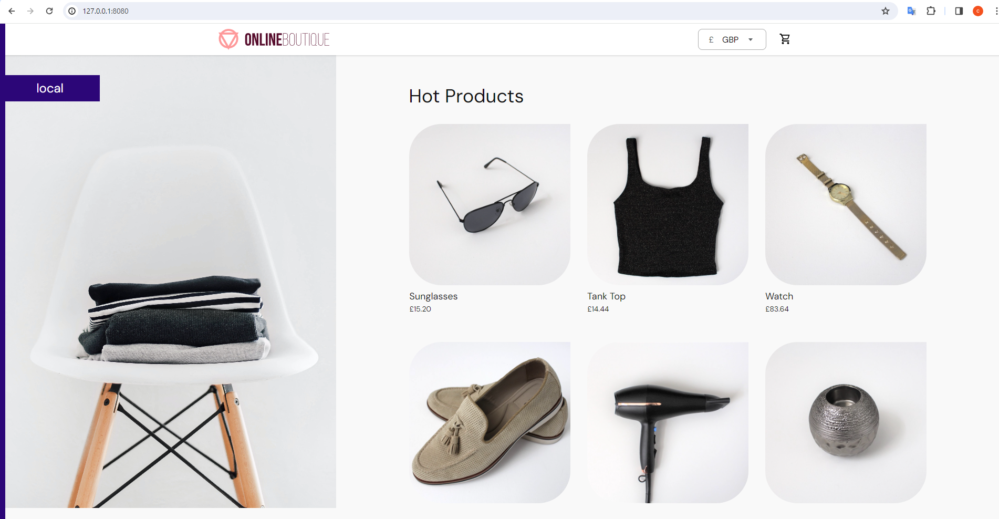

<p align="center">

</p>


**Online Boutique** is a cloud-first microservices demo application.  The application is a
web-based e-commerce app where users can browse items,
add them to the cart, and purchase them.

Google uses this application to demonstrate the use of technologies like
Kubernetes, GKE, Istio, Stackdriver, and gRPC. This application
works on any Kubernetes cluster, like Google
Kubernetes Engine (GKE). It’s **easy to deploy with little to no configuration**.

If you’re using this demo, please **★Star** this repository to show your interest!

**Note to Googlers (Google employees):** Please fill out the form at [go/microservices-demo](http://go/microservices-demo).

## Screenshots

| Home Page                                                                                                         | Checkout Screen                                                                                                    |
| ----------------------------------------------------------------------------------------------------------------- | ------------------------------------------------------------------------------------------------------------------ |
| [](/docs/img/online-boutique-frontend-1.png) | [](/docs/img/online-boutique-frontend-2.png) |

## Getting Started 

Clone the repository:

`git clone https://github.com/colossus06/ecommerce.git`
 

Deploy Online Boutique to the cluster:

```sh
cd ecommerce
k apply -f ./release/kubernetes-manifests.yaml
```

7. Wait for the pods to be ready.

   ```sh
   k get pod -w
   ```




**k3d cluster**

Edit the frontend-external svc type to Nodeport

`k edit svc frontend-external`




`k port-forward svc frontend-external 8080:80`



**Kubernetes in cloud**

Access the web frontend in a browser using the frontend's external IP.

```sh
k get service frontend-external | awk '{print $4}'
```
Visit `http://EXTERNAL_IP` in a web browser to access your instance of Online Boutique.


## Use Terraform to provision a GKE cluster and deploy Online Boutique

The [`/terraform` folder](/terraform) contains instructions for using [Terraform](https://www.terraform.io/intro) to replicate the steps from [**Quickstart (GKE)**](#quickstart-gke) above.

## Other deployment variations

- **Istio/Anthos Service Mesh**: [See these instructions.](/kustomize/components/service-mesh-istio/README.md)
- **non-GKE clusters (Minikube, Kind)**: see the [Development Guide](/docs/development-guide.md)

## Deploy Online Boutique variations with Kustomize

The [`/kustomize` folder](/kustomize) contains instructions for customizing the deployment of Online Boutique with different variations such as:
* integrating with [Google Cloud Operations](/kustomize/components/google-cloud-operations/)
* replacing the in-cluster Redis cache with [Google Cloud Memorystore (Redis)](/kustomize/components/memorystore), [AlloyDB](/kustomize/components/alloydb) or [Google Cloud Spanner](/kustomize/components/spanner)
* etc.

## Architecture

**Online Boutique** is composed of 11 microservices written in different
languages that talk to each other over gRPC.

[](/docs/img/architecture-diagram.png)

Find **Protocol Buffers Descriptions** at the [`./protos` directory](/protos).

| Service                                              | Language      | Description                                                                                                                       |
| ---------------------------------------------------- | ------------- | --------------------------------------------------------------------------------------------------------------------------------- |
| [frontend](/src/frontend)                           | Go            | Exposes an HTTP server to serve the website. Does not require signup/login and generates session IDs for all users automatically. |
| [cartservice](/src/cartservice)                     | C#            | Stores the items in the user's shopping cart in Redis and retrieves it.                                                           |
| [productcatalogservice](/src/productcatalogservice) | Go            | Provides the list of products from a JSON file and ability to search products and get individual products.                        |
| [currencyservice](/src/currencyservice)             | Node.js       | Converts one money amount to another currency. Uses real values fetched from European Central Bank. It's the highest QPS service. |
| [paymentservice](/src/paymentservice)               | Node.js       | Charges the given credit card info (mock) with the given amount and returns a transaction ID.                                     |
| [shippingservice](/src/shippingservice)             | Go            | Gives shipping cost estimates based on the shopping cart. Ships items to the given address (mock)                                 |
| [emailservice](/src/emailservice)                   | Python        | Sends users an order confirmation email (mock).                                                                                   |
| [checkoutservice](/src/checkoutservice)             | Go            | Retrieves user cart, prepares order and orchestrates the payment, shipping and the email notification.                            |
| [recommendationservice](/src/recommendationservice) | Python        | Recommends other products based on what's given in the cart.                                                                      |
| [adservice](/src/adservice)                         | Java          | Provides text ads based on given context words.                                                                                   |
| [loadgenerator](/src/loadgenerator)                 | Python/Locust | Continuously sends requests imitating realistic user shopping flows to the frontend.                                              |

## Features

- **[Kubernetes](https://kubernetes.io)/[GKE](https://cloud.google.com/kubernetes-engine/):**
  The app is designed to run on Kubernetes (both locally on "Docker for
  Desktop", as well as on the cloud with GKE).
- **[gRPC](https://grpc.io):** Microservices use a high volume of gRPC calls to
  communicate to each other.
- **[Istio](https://istio.io):** Application works on Istio service mesh.
- **[Cloud Operations (Stackdriver)](https://cloud.google.com/products/operations):** Many services
  are instrumented with **Profiling** and **Tracing**. In
  addition to these, using Istio enables features like Request/Response
  **Metrics** and **Context Graph** out of the box. When it is running out of
  Google Cloud, this code path remains inactive.
- **[Skaffold](https://skaffold.dev):** Application
  is deployed to Kubernetes with a single command using Skaffold.
- **Synthetic Load Generation:** The application demo comes with a background
  job that creates realistic usage patterns on the website using
  [Locust](https://locust.io/) load generator.

