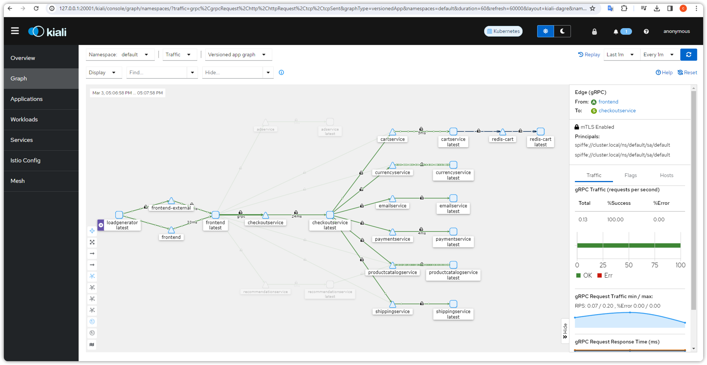
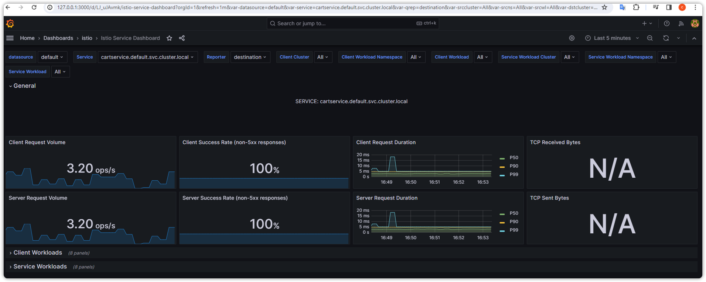

# Understanding Service Mesh and Observability

This week we will work on qdditional monitoring and observability Tools such as kiali.

Run the following command from istio directory:

`./install.sh`

This script automates the process of setting up Istio, and deploying addons like loki, jaeger, grafana, prometheus and kiali. 

Take a look at the script and try to understand each command's purpose.

Grafana: Visualizes metrics and dashboards for monitoring application and infrastructure performance. Data is sourced from Prometheus.
Prometheus: Scrapes metrics from various sources, including applications and Kubernetes components, and stores them for analysis.
Istio (optional): Service mesh for managing and monitoring service-to-service communication between microservices.
Kiali (optional): Provides a visualization interface for Istio, offering insights into service health, traffic flows, and configuration details.
For further information and configuration details regarding these tools, refer to their respective documentation:

# References

Grafana: https://grafana.com/docs/grafana/latest/getting-started/
Prometheus: https://prometheus.io/
Istio: https://istio.io/latest/docs/
Kiali: https://kiali.io/docs/
