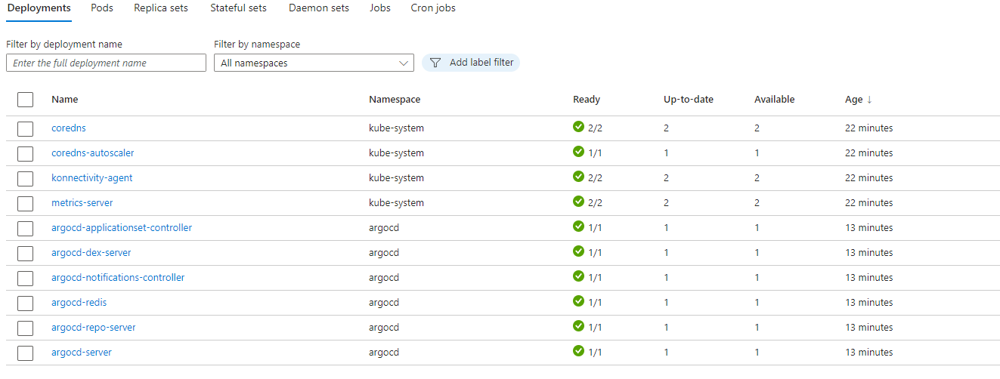
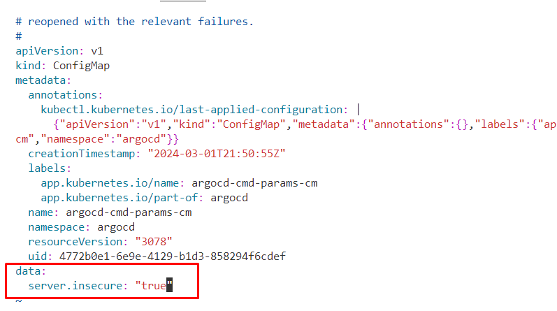
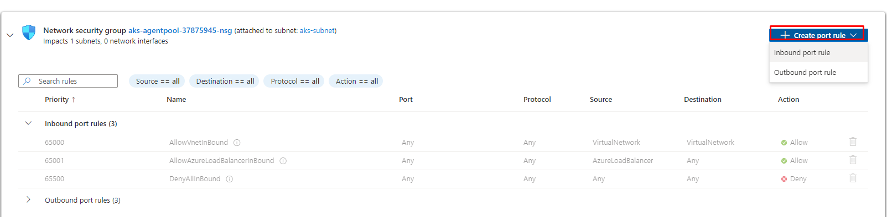
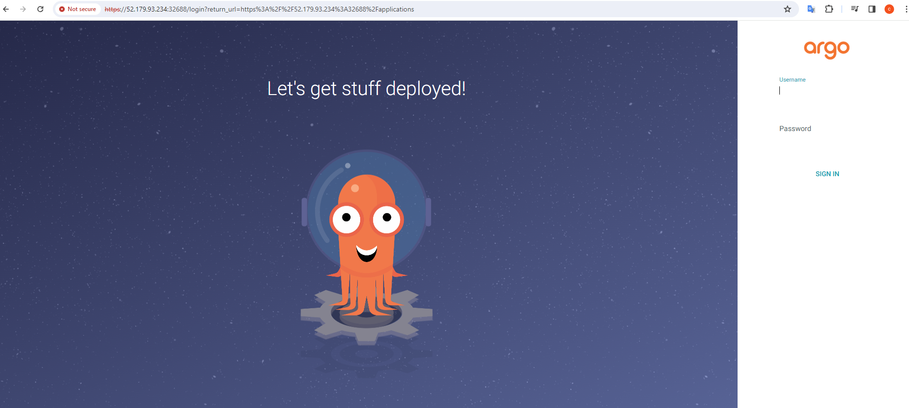
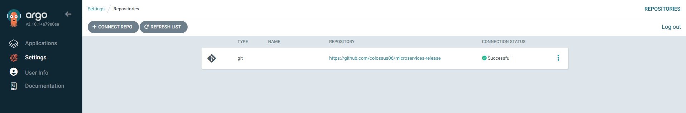

# Setup ecommerce app all weeks walkthrough

## Week I

**local**

```sh
git clone https://github.com/colossus06/ecommerce.git
cd ecommerce
k apply -f ./release/kubernetes-manifests.yaml
k edit svc frontend-external
k port-forward svc frontend-external 8080:80
```


**cloud**

```sh
git clone https://github.com/colossus06/ecommerce.git
cd ecommerce
k apply -f ./release/kubernetes-manifests.yaml
k get service frontend-external | awk '{print $4}'
```

## Week II-CI

#todo

## Week III-Infrasturcture Provisioning

Since we are follow gitops principles using ArgoCD, Kubernetes and Azure Devops we will need the following setup for CD

**CD**

* Hub spoke model cluster resource creation for dev and stage.
* We will use terraform.
* Setup one hub and two spoke clusters on Azure along with resource group
* Merge the clusters

```sh
cd terraform-gulcan
t init
t plan
t apply --auto-approve
```

### Merge the AKS cluster as current context in your .kube/config

After the resources are created login to the AKS cluster

```sh
az aks get-credentials --name hub-clu --overwrite-existing --resource-group rg-argocd
```


## Week IV-Multi Cluster Deployment-ArgoCD

Setup Argocd using helm

```sh
cd ../argocd
./install0helm.sh
```




**Setup ArgoCD http mode**

```sh
k get cm -n argocd
k edit cm -n argocd argocd-cmd-params-cm
```

Add the following entry:

```sh
data:
  server.insecure: "true"
```




Convert the server type from ClusterIP to NodePort

```sh
k edit svc argocd-server -n argocd
```


Connect SCM and ArgoCD

```sh
k get secret -n argocd
k get secret argocd-initial-admin-secret -n argocd -oyaml
echo <secret> | base64 -d
k get no -owide
```
### Allowing argocd-server inbound port from your ip

Open your vmss, instances and instance, network settings, add inbound port rule:



`destination port: argo-server-http port`

Access the argocd ui using the <node-ip> and the <http-port> 

`80:32688/TCP,443:32400/TCP`




`username: admin` and paste the admin password you got in the previous step.


**Local port forwarding**

```sh
k port-forward -n argocd argocd-server
k port-forward svc/frontend-external 8085:80
```

### Connect ArgoCD with the AKS Cluster

Create a manifest file 

```yaml
apiVersion: v1
kind: Secret
metadata:
  name: my-private-https-repo
  namespace: argocd
  labels:
    argocd.argoproj.io/secret-type: repository
stringData:
  type: git
  url: <release-manifests-repo-url>
  password: <pat>
  username: <github-username>
```

k apply -f repo-secret.yaml




### Creating an app

`vim app.yaml`

```yaml
apiVersion: argoproj.io/v1alpha1
kind: Application
metadata:
  name: devops
  namespace: argocd
spec:
  destination:
    namespace: default
    server: 'https://kubernetes.default.svc'
  source:
    path: ./
    repoURL: 'https://github.com/colossus06/microservices-release'
    targetRevision: master
  sources: []
  project: default
  syncPolicy:
    automated:
      prune: false
      selfHeal: false
```


## pulling images from private registries:


kubectl create secret docker-registry <secret-name> \
  --namespace <namespace> \
  --docker-server=<container-registry-name>.azurecr.io \
  --docker-username=<service-principal-ID> \
  --docker-password=<service-principal-password>


Adding image pull secret on the manifest files:

```yaml
imagePullSecrets:
- name: acr-secret
```

## Verifying that argocd picks up the new changes:


## Validation

[Youtube link-Microservices E-commerce App with Continuous Delivery PoC with Azure Devops](https://youtu.be/ZkdZxzPc6Zw)


## Week V-Service Mesh Visualizing


Run the following command to install istio, label the default namespace, prometheus, grafana, jaeger anf kiali.

```sh
cd istio
./install.sh
```


